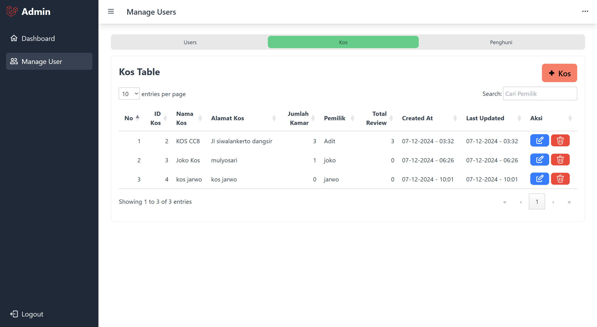

# Easy Kos
This is a laravel project build using tailwind css and daisy ui. We also integrate midtrans for payment gateway.

#### To setup:
* [Tailwind](https://tailwindcss.com/docs/guides/laravel)
* [DaisyUI](https://daisyui.com/docs/install/)
* Midtrans - create account first and get this key from midtrans, then put it in your .env file. Check this for more info ->
[Integration guide](https://docs.midtrans.com/docs/snap-snap-integration-guide)

```
MIDTRANS_MERCHANT_ID = ...
MIDTRANS_CLIENT_KEY = ...
MIDTRANS_SERVER_KEY = ...

```
## Authentication Side
Used middleware to handle user authentication.


## Admin
Admin can view the total overview of the website user, order and review made by customer. Admin can also do CRUD on users.





## Users - Visitor
Here visitor can view list of kos in the homepage, view the kos detail such as list of room avaiable, can order a room. For the payment, we integrate Midtrans as the payment gateway. Visitor can later review the kos after ordering.


## Users - Owner
Here owner can create a new account. If they are new, the will be redirected to create new kos first. Then they can view their order, and report. Owner can accept or reject visitor order. Owner can also view list of rooms they have and add a new one.


